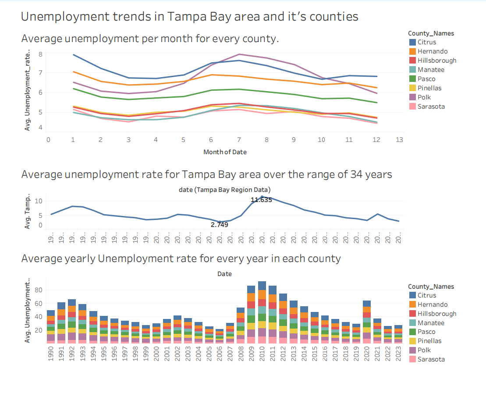

# State of the Region 2025 Analysis

This project delivers an in-depth analysis of Tampa Bay’s economic landscape as part of the *State of the Region 2025* report, with a particular focus on affordability and the development of a skilled talent pipeline. The analysis uses data collected from the FRED API and additional regional economic sources, organized and processed in this repository with data collection scripts, data cleaning workflows, and visualizations created in Tableau to support data-driven insights.

## Project Highlights

- **Data Sourcing**: Utilized the FRED API alongside local economic datasets to compile relevant information on Tampa Bay and its counties. The data includes metrics on employment rates, wage growth, and educational attainment, providing a comprehensive foundation for understanding the regional economy.

- **Data Visualization**: Created interactive Tableau dashboards that showcase trends across multiple economic indicators, such as unemployment, workforce composition, and cost-of-living factors for each county. These dashboards enable a granular view of the region's economic status and help identify trends over time.

- **Key Insights**: Conducted a comparative analysis to identify Tampa Bay’s strengths and growth opportunities, particularly in affordability and labor skill trends compared to similar regions. This analysis can inform strategies to enhance the region’s economic competitiveness.

## Skills Demonstrated

This project demonstrates the following key competencies:

- **API Data Collection**: Efficiently gathered and organized economic data using the FRED API.
- **Data Visualization**: Designed Tableau dashboards to clearly communicate complex economic trends.
- **Economic Analysis**: Conducted a data-driven analysis to provide actionable insights for regional economic development and strategic planning.

## Applications

The insights from this project offer valuable information for stakeholders in regional planning, economic development, and public policy. By examining affordability and the talent pipeline, this analysis highlights the Tampa Bay region's current standing and potential growth areas.

## Dashboard

